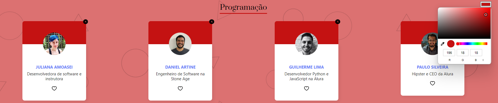
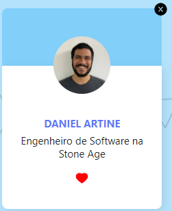

## `Objetivo `

Organo é um projeto desenvolvido em: 

## [React](./public/logo192.png)

<svg width="10%" height="10%" viewBox="-10.5 -9.45 21 18.9" fill="none" xmlns="http://www.w3.org/2000/svg" class="mt-4 mb-3 text-link dark:text-link-dark w-24 lg:w-28 self-center text-sm mr-0 flex origin-center transition-all ease-in-out"><circle cx="0" cy="0" r="2" fill="currentColor"></circle><g stroke="currentColor" stroke-width="1" fill="none"><ellipse rx="10" ry="4.5"></ellipse><ellipse rx="10" ry="4.5" transform="rotate(60)"></ellipse><ellipse rx="10" ry="4.5" transform="rotate(120)"></ellipse></g></svg>

seu foco é na adição de membros em equipes já pré estabelecidas de diferentes áreas do mundo de desenvolvimento, colocando os cards criados de cada membro em seus respectivos espaços, conforme a área selecionada.

### [Link do projeto](https://orgono-react.vercel.app/)

## `Tecnologias utilizadas durante o projeto`
* [React](https://react.dev/reference/react)
* JavaScript
* HTML
* CSS
* node.JS

## `Formulário:`

## `Cards criados em suas devidas áreas:`

## `Funcionalidades Extras:`

### Formulário para adicionar times, com a opção do usuário já colocar a cor desejada para a seção:

### Opção de troca de cor da seção:

### Botão de deletar e favoritar colaborador:

